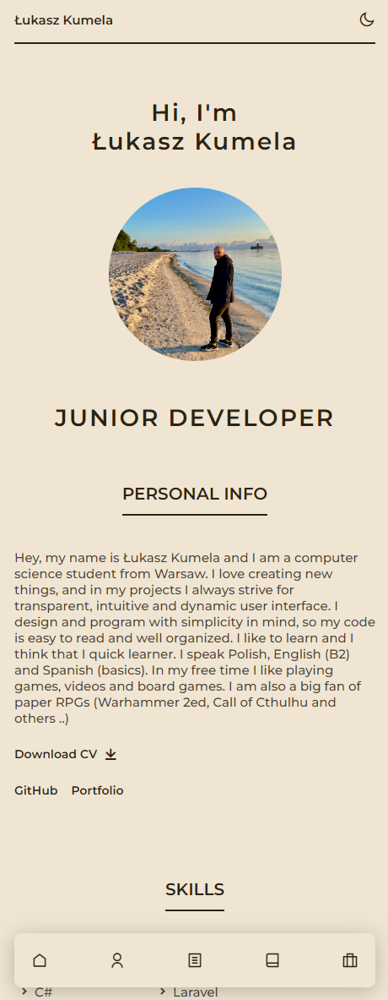

# Resume_CV #

My curriculum vitae (CV). In my CV, you may find my contact information, websites, education, experience, achievements, projects, and skills.


## :computer: Live Demo ##
See how it look & feel at :point_right: <a href="https://lkumela.github.io/Resume_CV/" target="_blank">Demo</a> :point_left:


## :desktop_computer: Preview
<table>
  <tr>
    <th>Desktop</th>
    <th>Mobile</th>
  </tr>
  <tr>
    <td>
        
    </td>
    <td>
        
    </td>
  </tr>
</table>

### Motives
There are 2 motives - light and dark
<table>
  <tr>
    <th>Light</th>
    <th>Dark</th>
  </tr>
  <tr>
    <td>
        
    </td>
    <td>
        
    </td>
  </tr>
</table>

## ⚙ Installation
1. **Download the source code:**
   - Clone the repository to your local machine:
     ```bash
     git clone https://github.com/lkumela/Resume_CV.git
     ```

2. **Navigate to the project directory:**
   - Open a terminal and go to the project directory:
     ```bash
     cd Resume_CV
     ```

3. **Open the HTML file:**
   - Use any text editor to open the HTML file in the project directory, e.g., `index.html`.

4. **Run in a browser:**
   - Double-click on the HTML file or open it using a web browser.
   - Alternatively, run the following command in the terminal to open the file in the default browser:
     ```bash
     open index.html
     ```

5. **Browse the page:**
   - Open a web browser and go to the address `http://localhost:3000` (or another port if specified in the HTML file).


### Additional steps (optional):

- **Customize the page:**
  - Edit the HTML file to customize the content of the page according to your needs.

- **Add styles and scripts:**
  - Make changes to the CSS and JavaScript files if they are available.

- **Publish on GitHub Pages:**
  - If you are using GitHub, consider using GitHub Pages to make the page publicly accessible.

Note that these steps are generic, and the specific configuration may vary depending on the project structure and tools used.

## Author

- **Łukasz Kumela**
  - :raising_hand_man: GitHub: [@lkumela](https://github.com/lkumela)
  - :email: Email: l.kumela@outlook.com